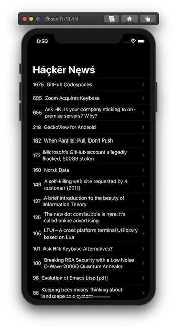
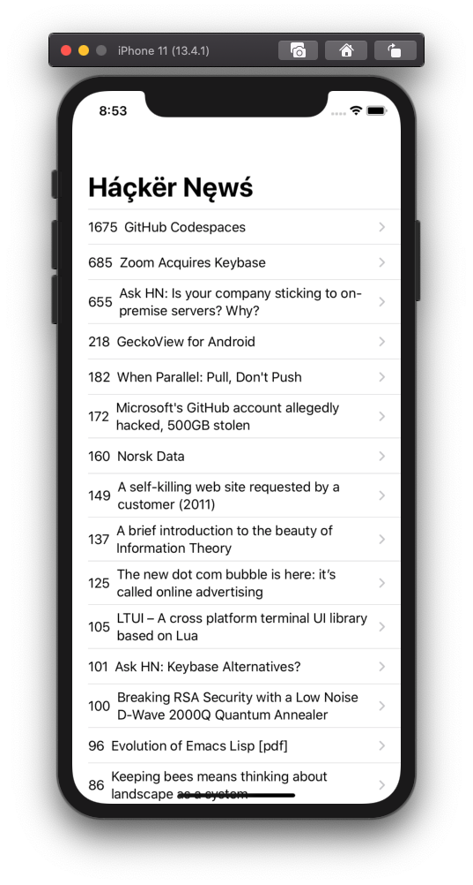
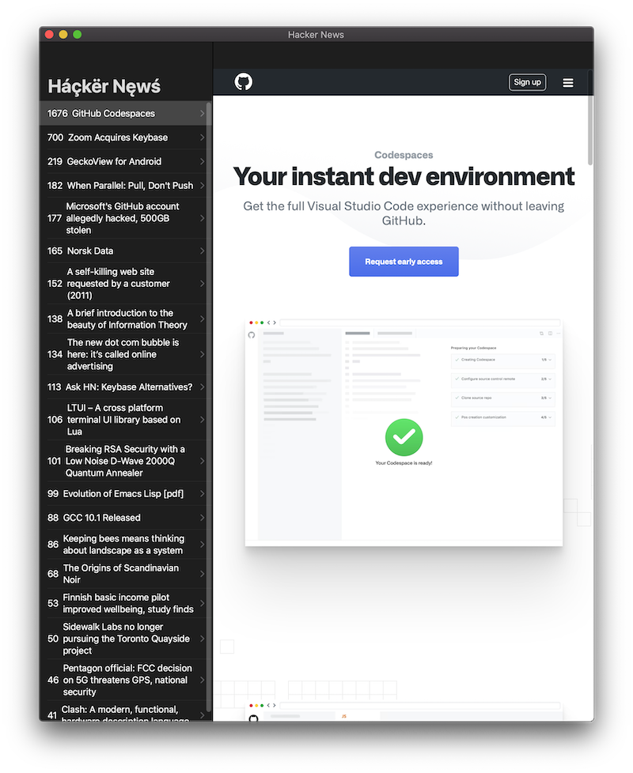

#  Hacker News - A Tech News App

## Complete Xcode Application for iOS and macOS

## To run on your Xcode

* Swift >= 4
* Xcode >= 10

## Features of this APP
* Dark Mode Support
* Named Colors for Dark/Light mode support
* Display hacker news and details in webview

## Swift Concepts Implemented
* SwiftUI
* Obervers ( ObservableObjects)
* JSON Decode
* Networking (APIs)

## App Preview

Dark Mode

Light Mode

Detail Screen

macOS

## Note:
As I developed this app while learning, you can suggest new features in it, idea to make the code readabilty better.